# Report: PostgreSQL Performance Analysis and Optimization

**Practical 02 — PostgreSQL Performance Analysis and Optimization**
Database: `student_perf_lab` (CRM/e-commerce). Load generated by `load_assignment_generator.py`.
---

## 1. Methodology

The analysis was performed on a live database under load (14 parallel workers). Diagnostic workflow:

**Observe → Diagnose → Form a hypothesis → Fix → Measure → Compare.**

Tools used:

| Tool | Purpose |
| --- | --- |
| `pg_stat_statements` | Ranking queries by total and mean execution time (aggregated history — "what hurts") |
| `EXPLAIN ANALYZE` | Real execution plans, actual rows and timing (interpretation — "why it is slow") |
| `pg_stat_activity` + `pg_blocking_pids()` | Instant snapshot of locks — "who is blocking whom right now" |
| `Buffers` in plans | Distinguishing `shared hit` (cache) vs `read` (disk) for an honest assessment |

**Baseline.** Before taking metrics the database was reloaded from scratch (`DROP DATABASE` → generator restart), and statistics counters were reset via `pg_stat_statements_reset()` after a ~5 min warm-up. This guarantees the "before" metrics contain no leftovers from previous experiments.

> **Key principle of this report.** Every finding is classified into one of three solution categories:
> 
> 1. **Fixable with an index** — a real access problem where an index helps;
> 2. **The query must be rewritten/reconsidered** — an index is powerless, the problem is in the query itself;
> 3. **Already works well** — `EXPLAIN ANALYZE` proved that no optimization is needed.

---

## 2. Identified Problems (summary table)

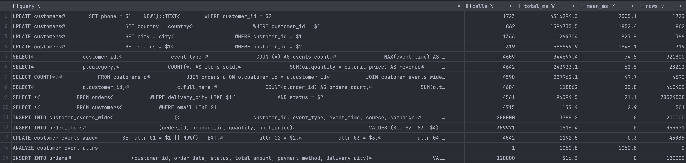

| # | Query | Diagnosis | Category |
| --- | --- | --- | --- |
| 1 | `search_customer_by_email` | `LIKE '%example%'` (leading `%`) → Seq Scan | 2 — rewrite |
| 2 | `orders_by_city_and_status` | `LIKE '%a%'` + low cardinality of `status` → Seq Scan | 2 + borderline 1 |
| 3 | `events_aggregation` | wide table `customer_events_wide` + time filter | normalization / partitioning |
| 4 | `heavy_join` | healthy Hash Join (38 ms) | 3 — leave alone |
| 5 | `cartesian_pressure` | healthy Parallel Hash Join; suffers from the filter on `events` | 3 + shared with #3 |
| 6 | `items_products_join` | healthy Hash Join (59 ms) | 3 — leave alone |
| — | **Concurrency** | lock contention on hot rows + deadlocks | bonus |

---

## 3. Detailed Analysis of Each Problem

### Problem #1 — `search_customer_by_email`

```sql
SELECT * FROM customers WHERE email LIKE '%example%';
```

**The problem.** The `LIKE` pattern starts with `%`. A B-tree index is ordered by the beginning of the string (left to right), so it can narrow the search only for patterns with a constant prefix (`'example%'`). The pattern `'%example%'` searches for a substring *inside* the value — the index cannot narrow the range, so a full `Seq Scan` over the entire `customers` table is performed.

**How it was found.** `pg_stat_statements` showed high `total_exec_time`; `EXPLAIN ANALYZE` — `Seq Scan on customers` with no index used.

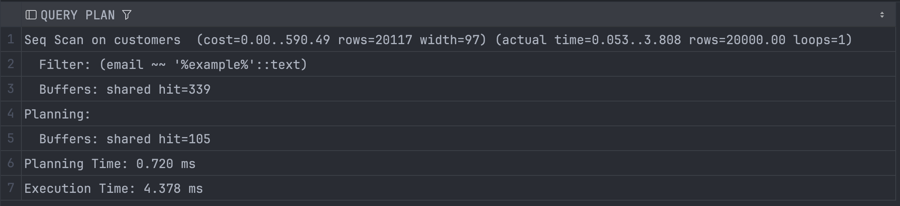

The plan confirms the diagnosis: `actual rows = 20000` — the filter passes **every single row** of the table (all emails share the same domain), a perfect illustration of a non-selective predicate.

**Category: 2 (rewrite).** Technically a trigram index (`pg_trgm` + GIN) capable of substring search does exist:

```sql
CREATE EXTENSION IF NOT EXISTS pg_trgm;
CREATE INDEX idx_customers_email_trgm ON customers USING gin (email gin_trgm_ops);
```

However, it is **inappropriate** here for two reasons: (a) `'%example%'` is non-selective — it returns a large fraction of rows, so the planner would choose a Seq Scan anyway; (b) the query is unrealistic — in a real CRM one searches `email = 'ivan@example.com'` (exact equality, indexes perfectly) or by domain. The right solution is to **rewrite the query for the real access pattern**, not to index an artificial condition.

---

### Problem #2 — `orders_by_city_and_status`

```sql
SELECT * FROM orders
WHERE delivery_city LIKE '%a%' AND status = 'paid';
```

**The problem (twofold).**

- `delivery_city LIKE '%a%'` — an unrealistic filter with a leading `%`; processed as a `Filter` after reading (no index applicable).
- `status = 'paid'` — a column of **low cardinality** (~5 distinct values across 120,000 rows). The value `paid` covers a significant fraction of the table, so a regular B-tree does not pay off: it is cheaper to read the data in bulk than to make tens of thousands of random index→table jumps. There is no index on `status`, so both conditions are handled by a full `Seq Scan`.

**How it was found.** `pg_stat_statements` (high total/mean) + `EXPLAIN ANALYZE`.

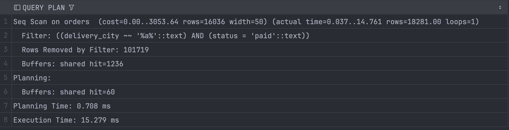

**Plan interpretation (important).** Since there is no index on `status`, and the leading-`%` `LIKE` filter cannot use an index, the planner chose a **`Seq Scan on orders`** — a full sequential read of the table with manual filtering. Measured: `actual rows = 18281` passed both conditions, `Rows Removed by Filter = 101719` were discarded; `width = 50`, `Execution Time = 15.3 ms`, `Buffers: shared hit` (everything from cache).

Both conditions (`delivery_city LIKE '%a%'` and `status = 'paid'`) ended up together in `Filter` — neither could use index access. This is a clean baseline without artificial indexes: it clearly demonstrates that with a non-selective `LIKE` and a low-cardinality `status` the planner deliberately chooses a Seq Scan. If a plain B-tree were added on `status`, the gain on such a large selection (`paid` ≈ 1/5 of the table) would be minimal — at best the planner would switch to a Bitmap Scan, never to a pinpoint Index Scan.

This plan is a vivid demonstration of how **cardinality and selection size** drive the choice of access strategy.

**Category: 2 for the `LIKE` part; borderline 1 for `status`.** Solution: rewrite the `LIKE` into equality on city; after that a **composite index** `(delivery_city, status)` becomes meaningful. For frequent queries on `paid` only — a **partial index**:

```sql
CREATE INDEX idx_orders_paid ON orders (status) WHERE status = 'paid';
```

> **Leftmost-prefix rule.** The composite index `(delivery_city, status)` serves searches by `delivery_city` and by `(delivery_city, status)`, but **not** by `status` alone without the city — because the index is sorted first by the first column. Column order must be chosen for the real query patterns.
> 

---

### Problem #3 — `events_aggregation` (wide table)

```sql
SELECT customer_id, event_type, COUNT(*), MAX(event_time)
FROM customer_events_wide
WHERE event_time >= NOW() - INTERVAL '180 days'
GROUP BY customer_id, event_type
ORDER BY events_count DESC LIMIT 200;
```

**The problem (two root causes).**

- **(A) Width.** The table has ~24 columns, including a dozen `attr_01..attr_10` stuffed with `fake.text(20)`. The query needs only 3 columns, but Postgres reads the whole row, in 8 KB pages. The fatter the row — the fewer rows per page — the more pages must be read from disk.
- **(B) Time filter with no index.** There is no index on `event_time`, so a Seq Scan with manual filtering is performed.

**How it was found.** `EXPLAIN ANALYZE` → `Seq Scan on customer_events_wide`.

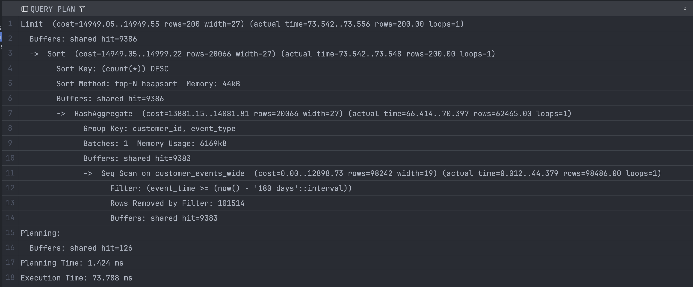

**Measured numbers.** `actual rows = 98486` passed the filter, `Rows Removed by Filter = 101514` were discarded → the filter passes **98,486 / 200,000 ≈ 49 %** of the table. `width = 19`, `Execution Time = 73.8 ms`, `Buffers: shared hit = 9383` (everything from cache).

**Interpretation.** 73.8 ms on a hot cache is **not a catastrophe**. The problem is **scalability**: as the table grows and pages get evicted from cache, a Seq Scan over wide rows will degrade linearly. Since the selection equals half the table, a regular index on `event_time` would give almost no benefit (the same lesson as with `status`).

**Category: mixed — primarily normalization + partitioning.** The query is sargable (the column is not wrapped in a function), so the interval itself does not need rewriting.

**Proposed solution (implemented in `02_events_normalization_partitioning.sql`):**

1. **Normalization** — move the cold `attr_*` columns into a separate table, keeping a narrow "hot" events table. Reduces `width` and the number of pages to read → attacks cause (A).
2. **Partitioning** of `customer_events_wide` by `event_time` (monthly RANGE partitions). **Partition pruning** lets the planner exclude irrelevant partitions *before* scanning → attacks cause (B) more effectively than an index. Implementation: create a partitioned table `PARTITION BY RANGE (event_time)` and migrate data via `INSERT ... SELECT`.
3. **Index on `event_time`** — auxiliary, useful only for narrow time windows.

> **Why partitioning beats an index for a date filter.** An index speeds up *searching inside* data that still has to be visited. Partitioning allows *not touching* whole chunks of data at all. With a wide time filter this removes data volume from the equation, not just the cost of lookup.
> 

---

### Query #4 — `heavy_join` (healthy, category 3)

```sql
SELECT c.customer_id, c.full_name, COUNT(o.order_id), SUM(o.total_amount)
FROM customers c JOIN orders o ON c.customer_id = o.customer_id
WHERE c.status = 'active'
GROUP BY c.customer_id, c.full_name ORDER BY revenue DESC LIMIT 100;
```

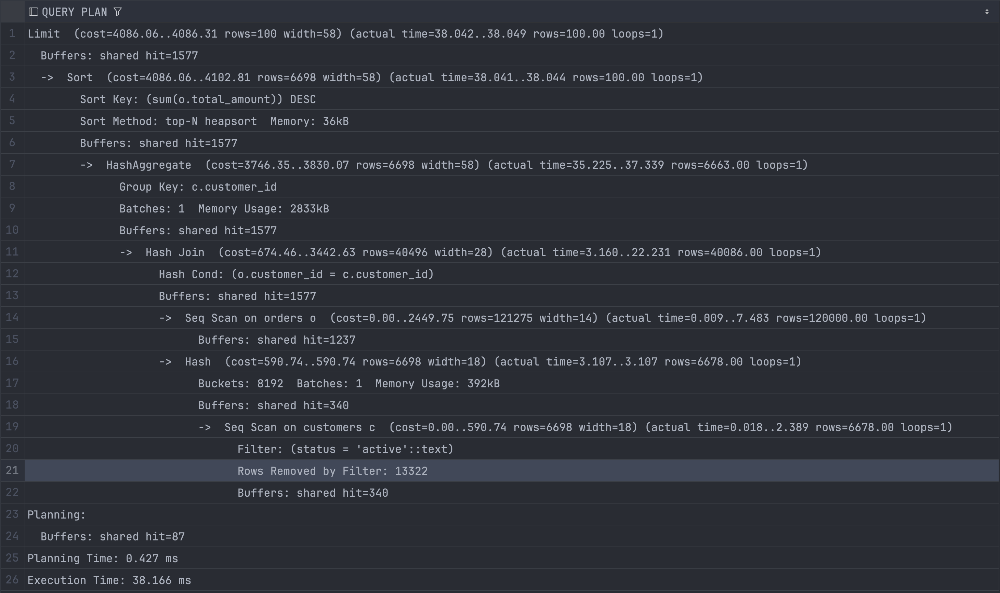

**Observations.** `Hash Join`; the hash is built from the smaller side — the filtered `active` customers (6678 rows, `Rows Removed by Filter: 13322`), while `orders` (120,000) passes in a single Seq Scan. The index `idx_orders_customer_id` is deliberately ignored — both sides are large. `Sort Method: top-N heapsort` thanks to `LIMIT` (optimal behavior). `Execution Time = 38.2 ms`.

**Conclusion.** The plan is optimal — Hash Join is the best choice here. **The query needs no optimization** (category 3).

---

### Query #5 — `cartesian_pressure` (healthy plan, category 3)

```sql
SELECT COUNT(*) FROM customers c
JOIN orders o ON o.customer_id = c.customer_id
JOIN customer_events_wide e ON e.customer_id = c.customer_id
WHERE c.status IN ('active','inactive')
  AND e.event_time >= NOW() - INTERVAL '90 days';
```

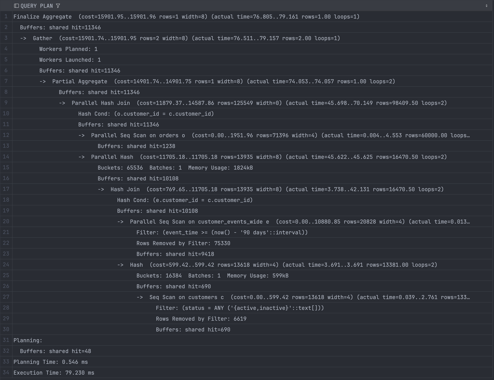

**Observations.** Despite its name, there is no full cartesian explosion: the planner builds the join stepwise (`events × customers`, then `× orders`) through hashes, keeping intermediate sets manageable. `Parallel Hash Join` + 1 extra worker is used (`Workers Launched: 1`). `Execution Time = 79.2 ms`, everything from cache.

**The only real pain** is the `Parallel Seq Scan on customer_events_wide` with `Rows Removed by Filter: 75330` (the same time filter as in #3). So partitioning `events` by `event_time` would help **two** queries at once.

**Conclusion.** The plan is healthy (category 3); shared benefit with solution #3.

---

### Query #6 — `items_products_join` (healthy, category 3)

```sql
SELECT p.category, COUNT(*), SUM(oi.quantity * oi.unit_price)
FROM order_items oi JOIN products p ON oi.product_id = p.product_id
GROUP BY p.category ORDER BY revenue DESC;
```

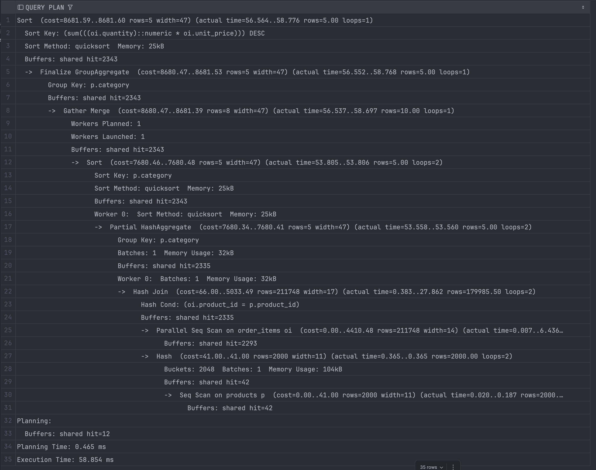

**Observations.** `Hash Join`; the hash is built from the smaller `products` (2000 rows, 104 KB), while `order_items` (~360k) passes through a `Parallel Seq Scan`. The index `idx_order_items_product_id` is not used — a full aggregation requires all rows anyway. `Execution Time = 58.9 ms`, everything from cache.

**Conclusion.** The plan is optimal — an index is useless for a full aggregation (category 3).

---

## 4. Implemented Changes

| Problem | Change | Category | Status |
| --- | --- | --- | --- |
| #1 `LIKE '%example%'` | Rewrite into equality / domain search | 2 | `01_query_rewrites_and_indexes.sql` |
| #2 `LIKE '%a%'` + `status` | Rewrite the `LIKE`; composite `(delivery_city, status)` / partial index | 2 / 1 | `01_query_rewrites_and_indexes.sql` |
| #3 wide `events` | Normalization + partitioning by `event_time` | normalization/partitioning | Implemented: `02_events_normalization_partitioning.sql` |
| Concurrency | Single lock ordering (see §6) | bonus | Implemented: `03_concurrency_lock_ordering.sql` |

> Queries #4, #5, #6 are deliberately **not optimized** — `EXPLAIN ANALYZE` proved their plans are already optimal.
> 

---

## 5. Before/After Comparison

| Metric | Before | After | Comment |
| --- | --- | --- | --- |
| `events_aggregation` Execution Time | 110.97 ms (Seq Scan, `Buffers: 9458`) | **58.66 ms** (`Subplans Removed: 6`, `Buffers: 714` — **13×** less I/O) | partition pruning + narrow table |
| `events_aggregation`, 14-day window | ~111 ms (the same full-table Seq Scan) | **8.3 ms** (`Subplans Removed: 11`, pruning leaves 2 partitions) | the gain grows as the window narrows |
| `cartesian_pressure` Execution Time | 79.2 ms | **58.6 ms** (`Subplans Removed: 9`) | shared benefit from partitioning |
| `UPDATE customers` mean_ms (hot rows) | ~2505 ms (`pg_stat_statements`, 1723 calls) | **~0.5 ms** (pinpoint UPDATE by PK with no lock queue) | see §6 |
| `deadlocks` counter (`pg_stat_database`) | **1493** | **0 new** after introducing a single lock ordering | see §6 |

### Optimization `events_aggregation` before:

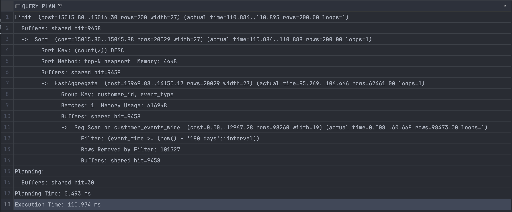

### Optimization `events_aggregation` after:

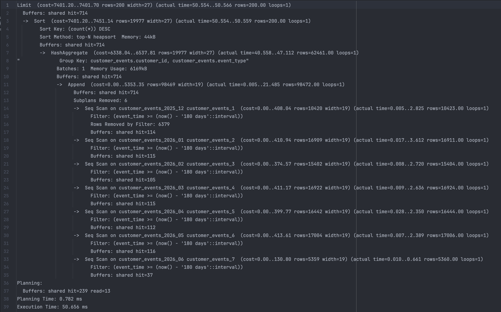

### Optimization `events_aggregation` after, with a narrow time window:

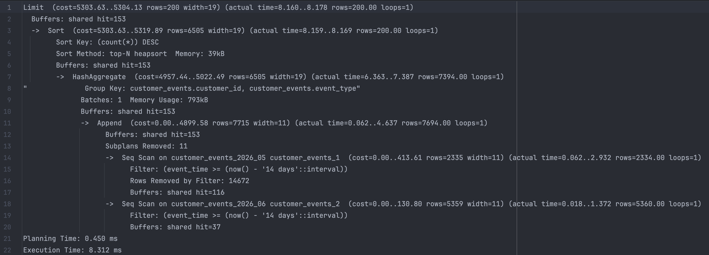

### Optimization `cartesian_pressure` after:

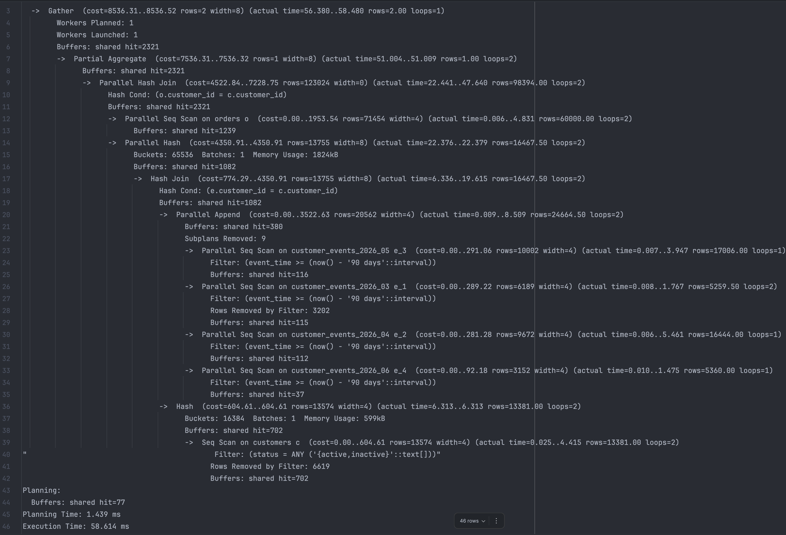

## 6. Bonus: Concurrency Analysis

### 6.1 Detection — lock contention

`pg_stat_statements` revealed an anomaly: pinpoint `UPDATE customers ... WHERE customer_id = $` by **primary key** had `mean_ms ≈ 2505` (top-1 by total_exec_time). For comparison — `UPDATE orders ... WHERE order_id` had `mean_ms = 0.4`. That is, an UPDATE of a single row by PK took ~2.5 s — thousands of times longer than normal.


**Rejected hypothesis.** At first we assumed the UPDATEs were slowed down by indexes (they also have to be updated). The hypothesis was refuted by a counterexample: `UPDATE orders` (which also has indexes) runs in 0.4 ms. So indexes are not the cause.

**The real cause — lock contention.** The UPDATE itself is instantaneous; the rest of the time is spent **waiting** for the lock. A transaction holds a row-level write lock **until `COMMIT`** (an ACID requirement: changes become visible only at commit, otherwise a dirty read would be possible on `ROLLBACK`). The `row_lock_holder_worker` workers deliberately keep the hot rows (`HOT_CUSTOMER_IDS = [1..5]`) locked for 8–15 s (`time.sleep` before commit), creating a queue.

### 6.2 Live reproduction

The query with `pg_blocking_pids()` caught specific blocked↔blocking pairs on `customer_id ∈ {1, 2}` — exactly the hot rows. The snapshot is dynamic (locks appear and disappear), so several snapshots were taken at different moments.

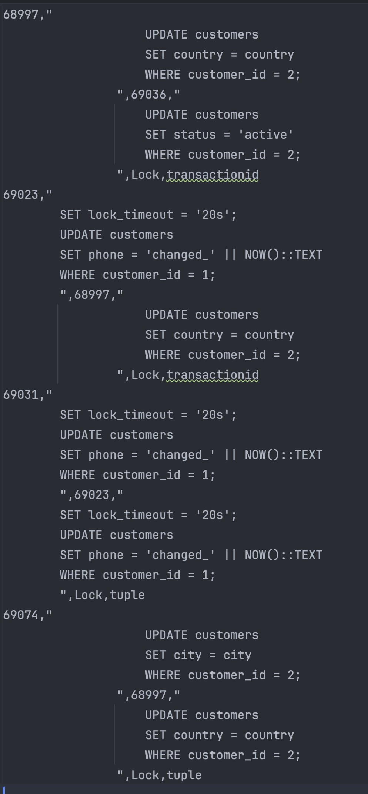

In the output the same `pid` appears now as `blocked`, now as `blocking` in different rows — a sign of a **wait chain**, which, when closed into a ring, produces a **deadlock**.

### 6.3 Deadlock root cause — Coffman conditions

A deadlock occurs only when four conditions hold simultaneously: **mutual exclusion**, **hold and wait**, **no preemption**, **circular wait**. In the script, `deadlock_a` takes rows in order `(1, 2)` while `deadlock_b` takes `(2, 1)`. The opposite order creates a **circular wait** (A→B→A). By the time of the snapshot the database deadlock counter had reached **1493**.

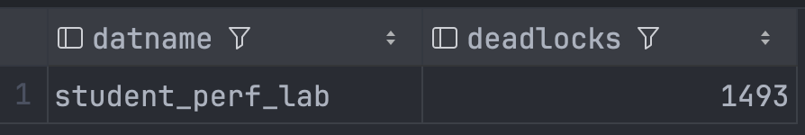

### 6.4 Solution — single lock ordering

If **all** transactions always take rows in a single global order (e.g., by ascending `customer_id`), circular wait becomes mathematically impossible — the ring cannot close.

### 6.5 Why "after" is better: progress preservation (liveness)

|  | Waiting | Deadlock |
| --- | --- | --- |
| Nature | temporary, self-resolving | permanent mutual standstill |
| Progress | yes — T1 moves toward COMMIT, T2 continues afterwards | zero — each waits for the one waiting for it |
| Outcome | the queue drains by itself | without intervention — hangs forever |

A single ordering guarantees that in the worst case there is only **waiting with progress**, never a standstill.

### 6.6 Symptomatic vs root-cause treatment

| Mechanism | What it does | Against what |
| --- | --- | --- |
| `deadlock_timeout` | ring detector, kills a victim | actual deadlocks |
| `lock_timeout` | give up after waiting N | any long wait (queue + deadlock) |
| **single lock ordering** | eliminates the possibility of a ring | the **root** of deadlocks |

`lock_timeout`/`deadlock_timeout` are painkillers (the transaction still fails and needs a retry). A single ordering removes the root: a deadlock cannot occur in principle.

---

## Conclusions

1. Of the six workload queries, **three** have real problems (#1, #2, #3), while **three** (#4, #5, #6) have optimal plans and need no intervention — as proven by `EXPLAIN ANALYZE`.
2. The problems fall into categories: "fixable with an index", "the query must be rewritten" and "already works well". Blindly adding indexes is an anti-pattern; some slow queries are deliberately unrealistic and require rewriting, not indexing.
3. The choice of access strategy (Seq / Bitmap / Index / Hash Join / Parallel) is driven by cardinality and selection size, not by the mere existence of an index.
4. The most significant finding is **lock contention and deadlocks**, reproduced and diagnosed via `pg_blocking_pids`; the root cause (circular wait) is eliminated by a single lock ordering, which preserves the system's liveness.

***THIS REPORT IS AI GENERATED, BUT I HAVE USED MY METHODS MY REASONING***